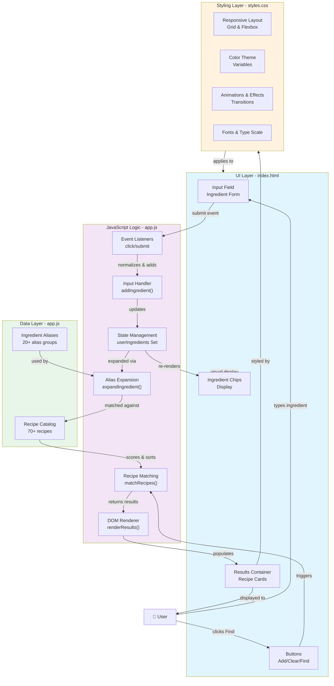

This diagram shows the complete architecture of your recipe generator app:

**UI Layer** (index.html)
- User input field and form
- Ingredient chips display
- Action buttons (Add, Clear, Find)
- Results container for recipe cards

**Styling Layer** (styles.css)
- Responsive grid/flexbox layout
- Color theme variables
- Animations and transitions
- Typography and font scaling

**Logic Layer** (app.js) — The Brain
- **State Management**: Keeps track of selected ingredients in a Set
- **Input Handler**: Normalizes and adds ingredients
- **Alias Expansion**: Maps user input ("beef") to recipe ingredients ("ground beef")
- **Recipe Matching**: Scores recipes based on ingredient overlap
- **DOM Renderer**: Updates results dynamically
- **Event Listeners**: Handles clicks and form submissions

**Data Layer** (app.js)
- Recipe Catalog: 70+ meals with ingredients and methods
- Ingredient Aliases: 20+ groupings for smarter matching

**Data Flow**
1. User types ingredient → Input Handler normalizes it
2. Added to State (Set of ingredients)
3. User clicks Find → Matching algorithm runs
4. Aliases expand user ingredients to recipe variations
5. Recipes scored and sorted by match strength
6. Renderer displays results with styling
